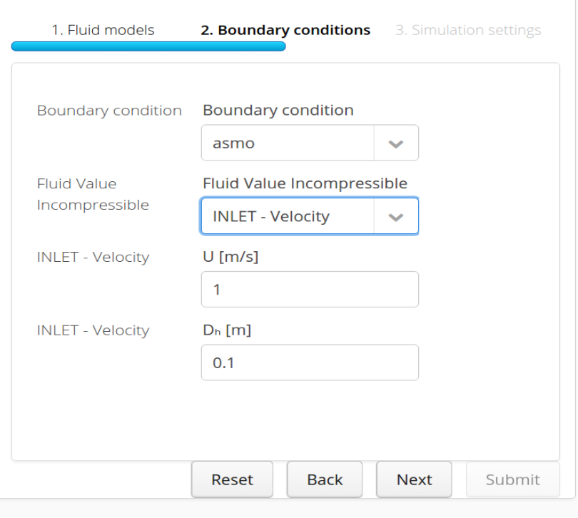

The CFD step represents the widest part of the whole simulation settings. The parameters present in the current step may vary according to the application chosen.

### Fluid Models

The first section is about defining the fluid models, turbulence and density in particular.

- *Flow type*: drop down list from which the user has to select the flow type
	- *Incompressible*: to simulate incompressible fluids like water, oil or air at low velocity.
	- *Compressible*: to simulate compressible ideal-fluids like air or gas in general

- *Turbulence*: drop down list from which the user has to select the turbulence model
	- *Laminar*: to simulate viscous flows in laminar regime
	- *k-epsilon*: to model turbulence via the two equations *k-epsilon* model ([reference](http://turbmodels.larc.nasa.gov/ke-chien.html))
	- *k-omega SST*: to model turbulence via the two equations *k-omega SST* model ([reference](http://turbmodels.larc.nasa.gov/sst.html))
	- *SA*: to model turbulence via the one equation *Spalart-Allmaras* model ([reference](http://turbmodels.larc.nasa.gov/spalart.html))

- *Fluid properties*: specification of the fluid properties parameters
- *Fluid initialization*: definition of the initial condition for the fluid variables

{}
Properties and parameters to insert vary with the Flow Type
{}

- *Turbulence initialization*: definition of the initial condition for the turbulent variables

We report here the most common initialization for the turbulent variables

- Turbulent kinetic energy: $k = \cfrac{3}{2} \left( \overline{u} \cdot I \right)^{2}$

- Turbulent dissipation rate: $\epsilon = \cfrac{0.09 k^{1.5}}{l}$

- Specific dissipation rate: $\omega = \cfrac{\sqrt{k}}{l}$

- Turbulent kinematic eddy viscosity: $\nu_{t} = \sqrt{\cfrac{3}{2}} \overline{u} \cdot I l$

where $I$ is the turbulence intensity (suggested between 1% and 10%) and l is the turbulence length scale, approximated with the hydraulic diameter $D_h$.

{}
Properties and parameters to insert vary with the Turbulence
{}

### Special sections

*[To be completed ...]*

### Boundary Conditions

The boundary conditions are the fundamental stage of the CFD simulations. CONSELF gives you a multiple choice of boundaries, each of which is target for the peculiar application you are currently using. Here you are a brief summary of what you are required to insert.

In this section it is possible to specify the boundary condition to apply to the flow. For instance, it is possible to define an inlet, an outlet or a wall. In order to do that the user has to specify for each flow variable its value (or gradient) at a specific boundary.

- *Boundary condition*: drop down list from which the user has to select every surface of which the geometry (and the bounding box) is composed in order to assign boundary conditions to it.

- *BC TYPE list*: a list of available boundary conditions to be assigned to every surface. Every choice of this list gives access to a certain number of parameters to be defined in order to process it correctly.

**In order to get hints and details about boundary conditions you may encounter check [this page](:Boundaries "wikilink").**

{}
By default every surface is assigned an adiabatic no-slip wall boundary condition.
{}

### Simulation Settings

- *Time scheme*: drop down list from which the user has to select which type of simulation they want to perform in terms of behavior in time
	- *Transient*: to setup a simulation where the focus is on how the flow changes in time, i.e. the quantities of interest are variable fluctuations over time
	- *Steady*: to setup a simulation where the focus is on the final flow configuration, i.e. the converged steady solution that does not change anymore

In case *Transient* scheme is chosen

- *Timestep*: time accuracy defining the requested temporal resolution.
- *Final time*: defines the final simulation time.
- *Output frequency*: rules how often simulation results are saved.

In case *Steady* scheme is chosen

- *Number of iterations*: number of iterations performed by the CFD solver. The higher the number, the more accurate the solution.
- *Output frequency*: specifies how often simulation results are saved for the visualization.

After completion of all fields, the user can finalize the step clicking on *Submit* button. This will start the **CFD** step application that will appear in the *Case in progress* section of the main *Simulation* page.

{}
The CFD step usually requires a high number of iterations (few thousands) in order to produce accurate results.
{}